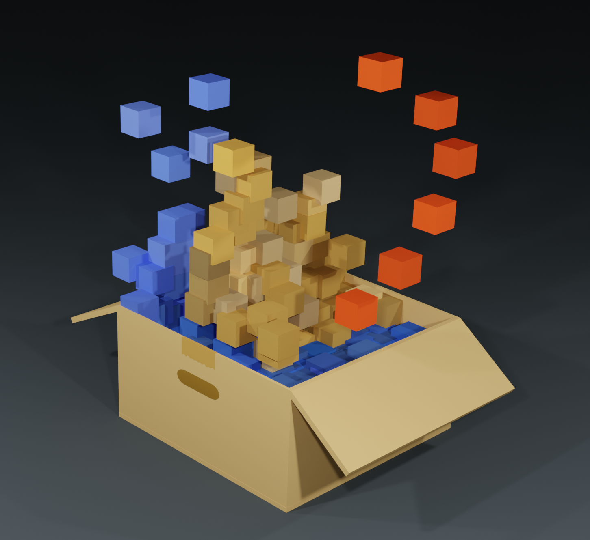

# Powder Game Bot
Stats bot and built-in web scraper for the Powder Games. This bot can extract stats from both Powder Game and Powder Game 2.

---

<p align="center">
  </img>
</p>

The Powder Games are fluid-dynamic sandbox simulations that allow users create and upload physically-accurate creations. Here are links to [Powder Game](https://dan-ball.jp/en/javagame/dust), [Powder Game 2](https://dan-ball.jp/en/javagame/dust2), and [the Unofficial Powder Game Discord](https://discord.gg/JDkfEBnREQ). This bot can be found in the Unofficial Powder Game Discord if you would like an invite and not host the bot yourself.

The prefix for all commands is `!` by default. Ex. `!help` or `!ping`.
Command | Action
| :---: | :---: |
user [pg/pg2] [username] | Get stats for a user.
ping | Gets ping.
stats | Returns bot stats.
help | Shows help messages and list of commands

---

The required packages can be installed with this command (given you have Node.js and NPM installed):
```
npm i axios cheerio discord.js request
```

⚠IMPORTANT⚠:
You'll have to create a `.env` file and add an environment variable `token` that has your bot token. You may have to install the `dotenv` package as well to load in the environment variable if necessary. If so, you'll also have to add `require("dotenv").config()` somewhere in the top of the program (where all the other packages are being required).
